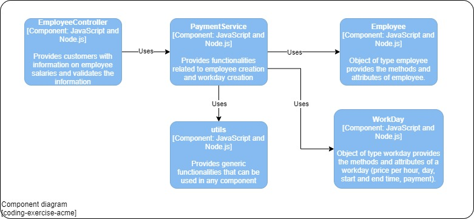
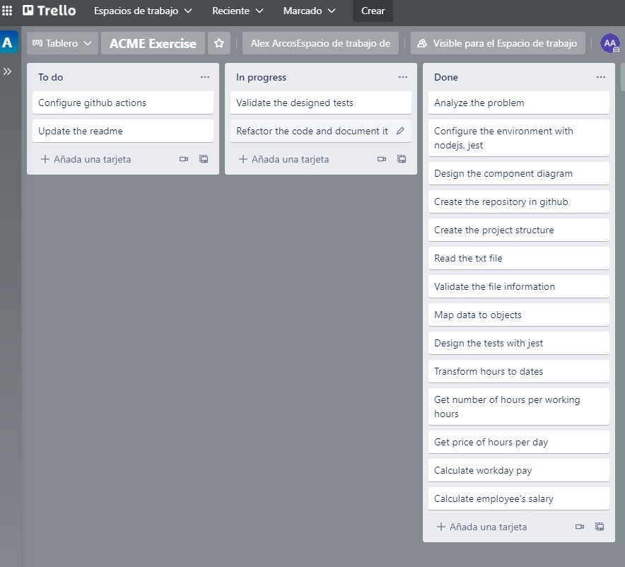

# ACME EXERCISE

[](https://github.com/ararcos/coding-exercise-acme/actions/workflows/node.js.yml)


This is a program for calculating the salary of ACME employees. It is an exercise to evaluate skills for the ioet developer job. The acme exercise was developed using nodejs.

Contents
========
 * [Problem Description](#problem)
 * [Installation](#installation)
 * [Arquitecture](#arquitecture)
 * [Approach and Methodology](#approach-and-methodology)

## Problem
The company ACME offers their employees the flexibility to work the hours they want. They will pay for the hours worked based on the day of the week and time of day, according to the following table:

__Monday - Friday__
| Start Hour | End Hour | Price |
| ------ | ------ | ------ |
| 00:01 | 09:00 | 25 USD|
| 09:01 | 18:00 | 15 USD|
| 18:01 | 00:00 | 20 USD|
__Saturday  - Sunday__
| Start Hour | End Hour | Price |
| ------ | ------ | ------ |
| 00:01 | 09:00 | 30 USD|
| 09:01 | 18:00 | 20 USD|
| 18:01 | 00:00 | 25 USD|

The goal of this exercise is to calculate the total that the company has to pay an employee, based on the hours they worked and the times during which they worked. The following abbreviations will be used for entering data:

| Day | Abbreviation |
| ------ | ------ |
| Monday | MO |
| Tuesday | TU |
| Wednesday | WE |
| Thursday | TH |
| Friday | FR |
| Saturday | SA |
| Sunday | SU |

__Input__: the name of an employee and the schedule they worked, indicating the time and hours. This should be a .txt file with at least five sets of data. You can include the data from our two examples below.
__Output__: indicate how much the employee has to be paid

__For example__

| __Input__ | __Output__ |
| ------ | ------ |
| ```RENE=MO10:00-12:00,TU10:00-12:00,TH01:00-03:00,SA14:00-18:00,SU20:00-21:00``` |  *The amount to pay RENE is: 215 USD* |
| ```ASTRID=MO10:00-12:00,TH12:00-14:00,SU20:00-21:00``` |  *The amount to pay ASTRID is: 85 USD* |

## Installation

ACME requires [Node.js](https://nodejs.org/) to run.

Clone the project:
```sh
git clone https://github.com/ararcos/coding-exercise-acme
```

Install the dependencies and devDependencies and start the server.
```sh
cd coding-exercise-acme
npm install
npm start
```

For Run Test...

```sh
npm run test
```

## Arquitecture

A component diagram of the c4 model was used, which provides insight into the structural construction of the program and its interactions.


## Approach and Methodology

For the development of this exercise I made an analysis of the information that the file (txt) should have, I validated some functionalities doing it by hand to understand how the program will behave and what data it should print.

Then I designed a component diagram to create the architecture that the program will have, choosing to handle it object oriented (Employee and workday) with a controller and a service.

- Create and configure the working environment with nodejs, jest and git.
- Create the project structure with controllers, models, services and utilities.
- Design the necessary tests to validate the input information and validate the functionalities to calculate the salary and the correct creation of the objects.
- Develop the solution to the problem and validate that all tests pass.
- Refactor the code
- Finally Update the readme and configure the github actions to automate the tests.

To manage the tasks use trello with the kanban methodology.
